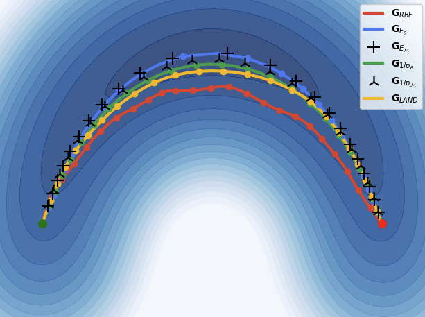
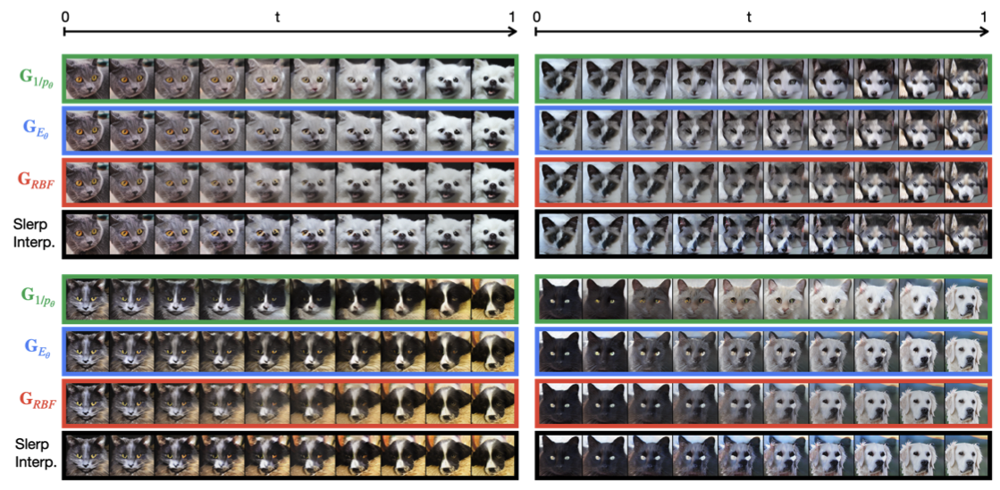

# Follow the Energy, Find the Path: Riemannian Metrics from Energy-Based Models

This repository contains the code to reproduce the NeuRIPS 2025 article: [Follow the Energy, Find the Path: Riemannian Metrics from Energy-Based Models](https://arxiv.org/pdf/2505.18230).


## 1. Tutorial
The easiest way to get familiar with the idea of the paper is to play with the tutorial (i.e. the notebooks in the /tutorial folders). 
### 1.1. Training EMBs
The notebooks [trainEBM_CD.ipynb](./tutorial/trainEBM_CD.ipynb) and [trainEBM_DSM.ipynb](./tutorial/trainEBM_DSM.ipynb), explain how to train de EBM, on the Circular Mixture of Gaussians dataset with Contrastive Divergence and Denoising Score Mathching, resptively. Both methods could be used (and works similarly well with good hyperparameters). To ensure reproducibility, we included the network checkpoints (for the EBM trained with DSM).

## 1.2. Learning Geodesics
Once the EBM are trained, we can use them to derive a Riemannian Metric that defines the data manifold. In the notebook [geodesics.ipynb](./tutorial/geodesics.ipynb), we show i) how to learn the geodesics in such an EBM-derived Riemannian manifold, ii) we benchmarked the obtained geodesics with alternative Riemannian metric. This notebook requires the EBMs weights that are provided in the checkpoints (i.e [EBM_mixture1.pth](./tutorial/EBM_mixture1.pth) and [EBM_mixture2.pth](./tutorial/EBM_mixture1.pth)). Note that, if you want to test EBM trained with other methods you need to change the checkpoints paths. This notebook reproduce the Figure 2 of the article:

<p align="center">
  
</p><em> Geodesics on WCG datasets. Some geodesics obtained for 6 different Riemannian metrics. The contour plots represent the energy landscape given by −log p. </em></p>

## 2. Geodesics on AFHQ datasets
### 2.1. Download and preprocess the AFHQ dataset
1. Download the AFHQ datasets: follow the instructions [here](https://github.com/clovaai/stargan-v2).
2. Unzip and save the datasets in ```your_path_to_data/afhq/```
3. run ```python dataset.py --dataset afhq --data_root your_path_to_data```. This script download the pretrained VAE from stable-diffusion-v1-4 (from the diffuser library of hugging face) and save all embdding from the AFHQ dataset in a file to save compute in subsequent run

### 2.2. Train the EBM
Run: 
```
python train_latent_ebm.py
            --dataset 'afhq'
            --data_root 'your_path_to_data'
            --save_root 'ebm_saving_path'
            --init_type 'normal_01'
            --training 'cdsm'
            --epoch 3000
            --n_steps 50
            --buffer_size 10000
            --energy_func 'VanillaNet_ELU_2'
```
This script will train the EBM on the AFHQ dataset

### 2.3. Learn the geodesics
Run: 
```
python train_interpolant.py
            --dataset 'afhq'
            --data_root 'your_path_to_data'
            --ebm_root 'ebm_your_saving_path'
            --save_root 'interpolant_saving_path'
            --ebm_ckpt 'path_to_the_ebm_checkpoint' 
            --batch_size 12
            --metric 'conf_ebm_logp'
            --t_steps 50
            --lr 1e-4
            --nb_iteration 200000 
```
Change ```--metric 'conf_ebm_logp'``` to ```--metric 'conf_ebm_invp'``` to change the type of Riemannian metric to compute the geodesics.
This script reproduce the Figure 6 of the article:


<p align="center">
  
</p><em> Geodesics on the AFHQ dataset. Each block shows an interpolated trajectory between two animal images (cats and dogs), projected back into image space for visualization. </em></p>
